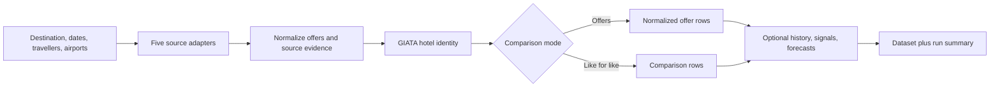

> **Live API:** [Run DACH Package Holiday Price API on Apify](https://apify.com/kamerozkan/dach-package-holiday-price-api)

# Package Holiday Price Comparison - Pauschalreise, TUI, DERTOUR: Samples

Compare Pauschalreise offers and package holiday prices across five German sources (TUI, DERTOUR, weg.de, ab-in-den-urlaub.de, alltours) in one normalized dataset: GIATA hotel matching, airport matrix, 90-day price history, market signals, buy-or-wait forecasts and signed price-drop webhook alerts.

[Run Package Holiday Price Comparison - Pauschalreise, TUI, DERTOUR on Apify](https://apify.com/kamerozkan/dach-package-holiday-price-api)

[](https://apify.com/kamerozkan/dach-package-holiday-price-api)


Compare Pauschalreise and package holiday offers across TUI, DERTOUR, weg.de, ab-in-den-urlaub.de, and alltours in one normalized dataset. The Actor exposes GIATA hotel identity, departure-airport context, like-for-like comparison fields, price history, market signals, and conservative buy or wait forecasts.

This repository contains the three current public Store Example Task inputs,
two historical release-QA inputs, three privacy-minimized real output
projections, machine-readable 1.0.23 release evidence, and the sample row
contract in [`dataset_record.schema.json`](dataset_record.schema.json).

## Start here

1. Open the [Actor on Apify](https://apify.com/kamerozkan/dach-package-holiday-price-api).
2. Choose one of the three public Example Task inputs below.
3. Keep the first run small and inspect source health, data quality, and billing.
4. Treat every price and availability field as a point-in-time observation.

At the 2026-08-13 verification, the Store exposed **three public Example
Tasks**. Inputs 01, 02, and 03 are their exact inputs and use rolling dates.

At the August 13, 2026 audit, build `1.0.23` passed an all-source comparison smoke.
All five selected sources were healthy, including the recovered alltours
adapter, and the Actor wrote three comparison rows from five normalized offers.
Two isolated history runs also proved that the first observation generated one
`history-update` charge while the unchanged repeat generated none. See
[`release_1_0_23_evidence.json`](release_1_0_23_evidence.json) and
[`DATA_NOTICE.md`](DATA_NOTICE.md) for the exact run, dataset, and billing
evidence.

## Price and calendar maintenance on October 4, 2026

The released maintenance validates normalized offers from TUI, DERTOUR, weg.de, ab-in-den-urlaub.de and alltours. Negative, nonfinite or nonnumeric required totals are rejected before offers can become the cheapest comparison. Invalid optional monetary amounts remain null. An explicitly supplied numeric zero is retained as a source value; it is not a booking or free-travel guarantee.

Supplied malformed calendar dates and return-before-departure dates reject the affected offer. Missing source dates remain null; the Actor does not manufacture them. Calendar-day prefixes are checked, without claiming validation of an entire timestamp suffix.

92 author tests and 17 independent check groups passed offline. Public `latest` build `1.0.25` (`9JKFZOpj5ssewuj93`) compiled successfully, and the server source hashes match the reviewed package. No new live source run was opened; current provider reachability and customer effect remain unverified. Existing examples and output projections retain their original dates and source evidence. See [`maintenance-verification-2026-10-04.json`](maintenance-verification-2026-10-04.json).

## Input examples

<details>
<summary><strong>01. Compare package holidays from Berlin</strong> - exact public Store Example Task</summary>

Store slug: `compare-package-holidays-from-berlin`

[`01_public_berlin_example_input.json`](01_public_berlin_example_input.json)

```json
{
  "departureAirports": [
    "BER"
  ],
  "destination": "Antalya",
  "endDate": "10 weeks",
  "includeRaw": false,
  "maxResultsPerOperator": 1,
  "startDate": "8 weeks"
}
```

</details>

<details>
<summary><strong>02. Compare operators for Antalya</strong> - exact public Store Example Task</summary>

Store slug: `compare-operators-for-antalya`

[`02_public_compare_operators_antalya_input.json`](02_public_compare_operators_antalya_input.json)

```json
{
  "destination": "Antalya",
  "startDate": "8 weeks",
  "endDate": "10 weeks",
  "departureAirports": [
    "MUC"
  ],
  "operators": [
    "tui",
    "dertour",
    "weg",
    "aidu",
    "alltours"
  ],
  "outputMode": "comparisons",
  "comparisonMode": "lowest_offer_in_search_window",
  "maxResultsPerOperator": 1,
  "sort": "priceAsc",
  "includeRaw": false,
  "history": {
    "enabled": false
  },
  "enrichment": {
    "enabled": false
  },
  "airportMatrix": {
    "enabled": false
  },
  "signals": {
    "enabled": false
  },
  "forecast": {
    "enabled": false
  },
  "alerts": {
    "enabled": false
  },
  "proxyConfiguration": {
    "useApifyProxy": false
  }
}
```

</details>

<details>
<summary><strong>03. Track Antalya package prices</strong> - exact public Store Example Task</summary>

Store slug: `track-antalya-package-prices`

[`03_public_track_antalya_prices_input.json`](03_public_track_antalya_prices_input.json)

```json
{
  "destination": "Antalya",
  "startDate": "8 weeks",
  "endDate": "10 weeks",
  "departureAirports": [
    "DUS"
  ],
  "operators": [
    "tui"
  ],
  "outputMode": "offers",
  "comparisonMode": "lowest_offer_in_search_window",
  "maxResultsPerOperator": 1,
  "sort": "priceAsc",
  "includeRaw": false,
  "history": {
    "enabled": true,
    "storeName": "example-antalya-package-price-history",
    "retentionDays": 90,
    "observationIntervalHours": 24,
    "emitSeries": true
  },
  "enrichment": {
    "enabled": false
  },
  "airportMatrix": {
    "enabled": false
  },
  "signals": {
    "enabled": false
  },
  "forecast": {
    "enabled": false
  },
  "alerts": {
    "enabled": false
  },
  "proxyConfiguration": {
    "useApifyProxy": false
  }
}
```

</details>

### Historical release-QA replay inputs

[`02_live_offer_qa_input.json`](02_live_offer_qa_input.json) and
[`03_comparison_forecast_qa_input.json`](03_comparison_forecast_qa_input.json)
preserve the exact fixed-date inputs used for the earlier output projections.
Their dates can expire; use rolling dates or a valid future window before
replaying them.

## Output examples

The first output is a field-level projection from the successful public Example Task dataset. The other two are projections from separate live-source release-QA datasets. Omitted fields were not inferred. See [`DATA_NOTICE.md`](DATA_NOTICE.md) for exact provenance and redactions.

<details>
<summary><strong>01. Public task TUI offer</strong> - owner-console dataset projection</summary>

[`01_public_task_offer_projection.json`](01_public_task_offer_projection.json)

```json
{
  "recordType": "offer",
  "operator": "tui",
  "tourOperator": null,
  "dachEntityId": "giata:631077",
  "hotel": {
    "name": "Ersoy Aga Otel",
    "category": 2,
    "location": {
      "city": "Antalya",
      "countryCode": "TR"
    }
  },
  "travel": {
    "searchWindowStart": "2026-09-22",
    "searchWindowEnd": "2026-10-06",
    "departureDate": "2026-09-24",
    "returnDate": "2026-10-01",
    "nights": 7
  },
  "departureAirport": {
    "requested": [
      "BER"
    ]
  }
}
```

</details>

<details>
<summary><strong>02. Like-for-like comparison</strong> - live-source release-QA projection</summary>

[`02_live_comparison_projection.json`](02_live_comparison_projection.json)

```json
{
  "recordType": "comparison",
  "dachEntityId": "giata:631077",
  "comparisonKey": "redacted-comparison-key-02",
  "comparisonBasis": "like_for_like_package",
  "hotel": {
    "name": "Ersoy Aga Otel",
    "category": 2,
    "location": {
      "city": "Antalya",
      "region": "Türkische Riviera",
      "country": "Türkei",
      "countryCode": "TR"
    }
  },
  "travel": {
    "searchWindowStart": "2026-09-24",
    "searchWindowEnd": "2026-10-15"
  },
  "offers": [
    {
      "recordType": "offer",
      "operator": "aidu",
      "operatorLabel": "ab-in-den-urlaub.de",
      "tourOperator": null,
      "dachEntityId": "giata:631077",
      "hotel": {
        "name": "Ersoy Aga Otel",
        "category": 2,
        "location": {
          "city": "Antalya",
          "region": "Türkische Riviera",
          "country": "Türkei",
          "countryCode": "TR"
        }
      },
      "travel": {
        "searchWindowStart": "2026-09-24",
        "searchWindowEnd": "2026-10-15",
        "departureDate": "2026-09-24",
        "returnDate": "2026-10-01",
        "nights": 7
      },
      "occupancy": {
        "adults": 2,
        "childAges": []
      },
      "departureAirport": {
        "iata": "DUS",
        "requested": [
          "DUS"
        ],
        "source": "requested"
      },
      "room": {
        "name": "Doppelzimmer MIT GEMEINSCHAFTSBAD"
      },
      "board": {
        "name": "Ohne Verpflegung"
      },
      "flight": null,
      "transfer": {
        "included": null,
        "optionalPrice": null,
        "evidence": "unavailable"
      },
      "availability": {
        "status": "available"
      },
      "discounts": [
        {
          "type": "price_reduction",
          "label": "ab-in-den-urlaub.de displayed price reduction",
          "amount": 306,
          "percent": 36.8
        },
        {
          "type": "campaign",
          "label": "Cashback voucher (conditional)",
          "amount": 25,
          "percent": null
        }
      ],
      "price": {
        "total": {
          "amount": 526,
          "currency": "EUR"
        },
        "originalTotal": {
          "amount": 832,
          "currency": "EUR"
        },
        "savingPercent": 36.8,
        "taxesIncluded": null,
        "mandatoryFees": [],
        "completeness": "unknown"
      },
      "source": {
        "url": "https://www.ab-in-den-urlaub.de/",
        "observedAt": "2026-07-26T13:34:40.178Z",
        "destination": {
          "id": "city-tr-930-antalya",
          "name": "Antalya",
          "type": "city",
          "parentName": "Mittelmeerregion"
        }
      },
      "matching": {
        "departureDate": "exact",
        "nights": "exact",
        "occupancy": "exact",
        "departureAirport": "requested",
        "room": "normalized",
        "board": "normalized",
        "roomClass": "double",
        "boardClass": "room_only"
      }
    }
  ],
  "cheapestOperator": "aidu",
  "cheapestTotalPrice": 526,
  "currency": "EUR",
  "priceSpread": null,
  "matchQuality": {
    "score": 0.92,
    "likeForLike": true,
    "dimensions": {
      "hotel": "exact",
      "departureDate": "exact",
      "nights": "exact",
      "occupancy": "exact",
      "departureAirport": "requested",
      "room": "normalized",
      "board": "normalized"
    },
    "unavailableDimensions": [],
    "mixedDimensions": []
  },
  "observedAt": "2026-07-26T13:34:40.178Z"
}
```

</details>

<details>
<summary><strong>03. Forecast abstains with insufficient evidence</strong> - live-source release-QA output</summary>

[`03_live_insufficient_forecast.json`](03_live_insufficient_forecast.json)

```json
{
  "recordType": "buy_wait_forecast",
  "forecastKey": "redacted-forecast-key-03",
  "seriesKey": "redacted-series-key-03",
  "offerKey": "redacted-offer-key-03",
  "comparisonKey": "redacted-comparison-key-03",
  "operator": "aidu",
  "dachEntityId": "giata:631077",
  "hotelName": "Ersoy Aga Otel",
  "currency": "EUR",
  "recommendation": "insufficient_data",
  "confidence": {
    "score": 0.1,
    "level": "low"
  },
  "horizonDays": 7,
  "currentPrice": 526,
  "forecastPrice": 526,
  "evidence": {
    "observationCount": 2,
    "robustTrendPerDay": 0,
    "expectedChangePercent": 0,
    "volatilityPercent": 0,
    "daysToDeparture": 60,
    "capacityNarrowingScore": null
  },
  "rationale": [
    "2/3 required observations are available."
  ],
  "generatedAt": "2026-07-26T13:34:43.064Z",
  "disclaimer": "Informational estimate only; prices and availability can change and this is not a booking guarantee."
}
```

</details>

## Consumer decision guide

| Record or field | Suggested use | Important boundary |
|---|---|---|
| `recordType = offer` | Store a point-in-time source observation | The provider can revalidate at checkout |
| `recordType = comparison` | Compare only when `matchQuality` meets your policy | Same hotel does not automatically mean same package |
| `recordType = price_series` | Analyze repeated observations | Polling is not continuous market coverage |
| `recordType = market_signal` | Use as an explainable availability proxy | It is not hotel occupancy |
| `recordType = buy_wait_forecast` | Require adequate evidence and confidence | It is informational, not a booking recommendation |
| `recordType = run_diagnostic` | Preserve empty-run and source-failure context | Do not translate failure into zero availability |
| Missing or `unknown` fields | Keep them nullable | Do not manufacture baggage, transfer, fees, or cancellation evidence |

## Why the normalized contract matters

| Data problem | Basic scraper output | This Actor's documented output |
|---|---|---|
| Hotel identity | Provider-specific name string | GIATA-oriented `dachEntityId` plus match quality |
| Package comparability | Lowest displayed number | Date, nights, occupancy, airport, room, and board dimensions |
| Partial source failure | Empty result with no cause | Typed source health and run diagnostics |
| Price context | One number | Total, per-person, original price, savings, fees, and completeness |
| Forecast confidence | Unqualified buy or wait label | Evidence count, confidence, rationale, and explicit abstention |



## Important boundaries

- The Actor is independent and unofficial. It is not affiliated with any listed travel provider.
- Prices and availability are observations, not booking guarantees.
- Missing evidence remains null or unknown.
- Source interfaces can change and partial results are possible.
- The public Store headline is not necessarily the complete run charge because source searches and optional features can be separate events.

For exact provenance, audit evidence, redactions, and pricing limits, read [`DATA_NOTICE.md`](DATA_NOTICE.md).
